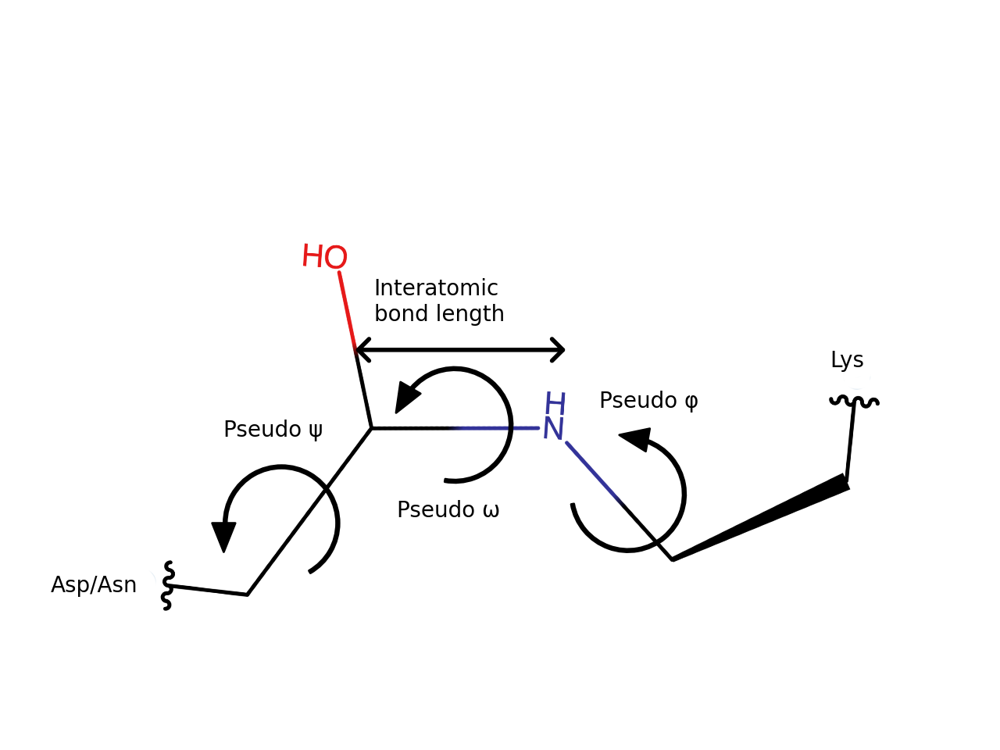

Workflow
========

Input
-----
Protein structures in PDB or CIF format.

.. warning::
    CIF file parsing is handled by CIF to PDB conversion at the moment. 
    This is not suitable for very large protein structures.

Prediction
----------
Isopeptor employs `pyjess <https://pypi.org/project/pyjess/>`_ to perform a template-based search of input protein structures
from a database of 140 high resolution intramolecular isopeptide bond structures. Example templates are displayed in 
:ref:`Isopeptor workflow` 1. (only labelled atoms belong to the template). Pyjess reports the 
`Root Mean Square Deviation (RMSD) <https://en.wikipedia.org/wiki/Root_mean_square_deviation>`_
between each template and matcging group of three residues, which consist of the two residues directly involved
in the isopeptide bond (lys-asp/asn) and the catalytic residue (asp/glu).
If multiple templates match the same group of residues, only the lowest RMSD is reported (:ref:`Isopeptor workflow` 2.).
Isopeptor also calculates the 
`relative Accessible Solvent Area (rASA) <https://en.wikipedia.org/wiki/Relative_accessible_surface_area>`_ 
(:ref:`Isopeptor workflow` 3.).
We decided to include rASA calculation to take into consideration the fact that
intramolecular isopeptide bonds form only in a buiried hydrophobic environment.
RMSD and rASA are used by a `logistic regression model <https://en.wikipedia.org/wiki/Logistic_regression>`_ to 
predict the presence of intramolecular isopeptide bonds (:ref:`Isopeptor workflow` 4.), which are assigned for probability values above 0.5.
Optionally, geometric evaluation is applied to assess the structural quality of predicted isopeptide bonds 
(:ref:`Isopeptor workflow` 5.).

.. figure:: figures/f2.png
   :name: Isopeptor workflow
   :alt: Isopeptor workflow.
   :width: 600px
   :align: center

   Isopeptor workflow

Geometric evaluation
--------------------

Isopeptor can optionally evaluate the quality of intramolecular isopeptide bonds. This is done using two metrics:

#. Bond lenght `Z-score <https://en.wikipedia.org/wiki/Standard_score>`_. Outliers are assigned for z-score values above 4 or below -4.
#. `Kernel Density Estimate (KDE) <https://en.wikipedia.org/wiki/Kernel_density_estimation>`_ likelihood of pseudo dihedral angles (pseudo φ, pseudo ψ, pseudo ω). 6 different KDE models are employed: one for each combination of of angle pairs  and isopeptide bond type. Outliers are assigned for values of KDE likelihood outside the 95th percentile distribution of values from our database.
    

.. note::
    Isopeptide bond angles have been named after the peptide-bond dihedral angles nomenclature: 
    pseudo φ is the angle around the bond between Asp/Asn\ :sub:`Cβ` and Asp/Asn\ :sub:`Cγ`, ω between Asp/Asn\ :sub:`Cγ` 
    and Lys\ :sub:`Nζ` bond, and ψ between  Lys\ :sub:`Nζ` and Lys\ :sub:`Cε` bond.

Output
------
Isopeptor output consists of the follwoing fields:

* *protein_name*
* *probability*: probability calculated with the logistic regression model. Intramolecular isopeptide bonds are assigned for values above 0.5. 
* *chain*: protein chain
* *r1_bond*: position of the first residue involved in the intramolecular isopeptide bond (lysine)
* *r_cat*: position of the intramolecular isopeptide bond catalytic residue (aspartate/glutamate)
* *r2_bond*: position of the second residue involved in the intramolecular isopeptide bond (asparagine/aspartate)
* *r1_bond_name*: name of the first residue involved in the intramolecular isopeptide bond (lysine)
* *r_cat_name*: name of the intramolecular isopeptide bond catalytic residue (aspartate/glutamate)
* *r2_bond_name*: name of the second residue involved in the intramolecular isopeptide bond (asparagine/aspartate)
* *bond_type*: CnaA-like or CnaB-like. This is assigned based on the type of the closest template.
* *rmsd*: RMSD (Å) with the closest template.
* *r_asa*: rASA (ranges between 0 and 1).
* *template*: name of the closest template.

And optional fields generated with geometric evaluation:

* *bond_length*: bond length calculated between Lys\ :sub:`Nζ`\ and Asp/Asn\ :sub:`Cγ`\. If  Lys\ :sub:`Nζ`\ atom is missing, isopeptor will attempt using Asn\ :sub:`Nδ`\ instead.
* *bond_length_zscore*: value of bond length Z-score.
* *bond_length_allowed*: True/False. False if Z-score is below -4 or above 4.
* *pseudo_<phi,psi,omega>*: value of pseudo dihedral angles in degrees.
* *<phi_psi,omega_psi,omega_phi>_likelihood*: KDE likelihood for given angle pairs.
* *<phi_psi,omega_psi,omega_phi>_allowed*: True/False. False if the likelihood for the given pair of angles is not within the 95th percentile threshold.